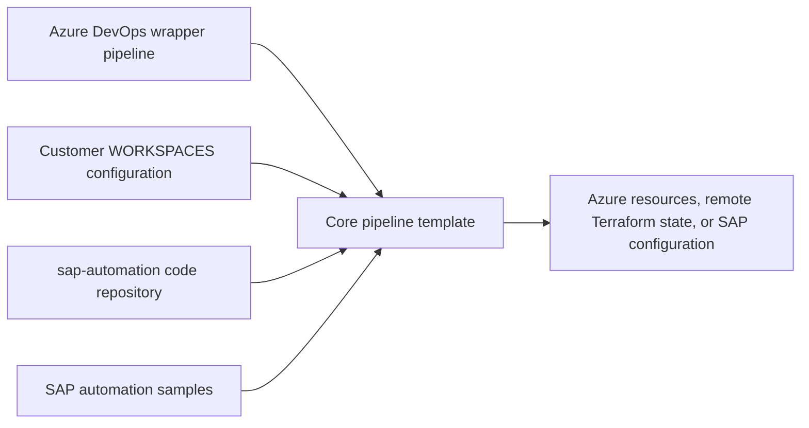

# SAP Deployment Automation Framework for Azure DevOps

This repository is the customer configuration and wrapper-pipeline repository
for running SAP Deployment Automation Framework (SDAF) through Azure DevOps.
It stores deployment configuration under `WORKSPACES` and calls implementation
templates from the separate `sap-automation` code repository.

For framework architecture, execution-model selection, and local execution,
return to the central
[`Azure/sap-automation`](https://github.com/Azure/sap-automation) documentation
hub.

Use the current Microsoft Learn article,
[Configure Azure DevOps for SAP Deployment Automation](https://learn.microsoft.com/azure/sap/automation/configure-devops?tabs=linux),
as the supported setup baseline. The pages in this repository organize that
journey and add details verified against the current wrapper pipelines.

## Start the Azure DevOps journey

Complete the journey in order:

1. [Prepare Azure and Azure DevOps prerequisites](docs/01-00-prerequisites.md).
   You confirm access, identity, networking, quota, SAP access, and agent
   readiness.
2. [Bootstrap the Azure DevOps project](docs/02-00-bootstrap.md). You create or
   configure repositories, variable groups, service connections, pipelines,
   permissions, and agent pools.
3. [Deploy the control plane](docs/03-00-control-plane.md). You prepare deployer
   and library configuration, review the test run, and run pipeline `01`.
4. [Deploy a workload zone](docs/04-00-workload-zone.md). You prepare landscape
   configuration and run pipeline `02`.
5. [Deploy SAP-system infrastructure](docs/05-00-sap-system.md). You prepare
   system configuration and run pipeline `03`.
6. [Acquire software and install SAP](docs/06-00-software-and-installation.md).
   You select a bill of materials (BOM), download software, and run the selected
   installation stages.
7. [Operate or remove the deployment](docs/07-00-operations.md). You update
   repositories and pipelines, rotate credentials, and perform controlled
   removal.

Use [Troubleshoot Azure DevOps deployments](docs/troubleshooting.md) for
symptom-based diagnostics and [Pipeline reference](docs/pipeline-reference.md)
for the wrapper-to-template map.

For automated setup, run the documented scripts in this order:

1. [Configure the Azure DevOps project and control-plane artifacts](docs/02-10-configure-devops-project.md).
2. [Configure workload-zone artifacts](docs/02-20-configure-workload-zone-artifacts.md).

These scripts configure Azure DevOps assets. They don't deploy Azure
infrastructure. Run the deployment pipelines in the remaining journey steps.

## Current capability boundaries

Azure DevOps and GitHub Actions implement the same SDAF lifecycle, but their
automation is not identical.

- Pipeline `22-sample-deployer-configuration.yml` creates deployer and library
  examples and rewrites selected wrapper defaults.
- No verified full Azure DevOps equivalent exists for GitHub configuration
  workflow `02`, which generates workload-zone configuration.
- No verified full Azure DevOps equivalent exists for GitHub configuration
  workflow `04`, which generates SAP-system configuration.
- Prepare workload-zone and SAP-system files from reviewed
  [`Azure/SAP-automation-samples`](https://github.com/Azure/SAP-automation-samples)
  content, the SDAF configuration Web application where applicable, or direct
  customer editing. Store the reviewed files under `WORKSPACES`.
- The public selection criteria for
  `04-sap-software-download.yml` and
  `04-sap-software-download_v2.yml` are not confirmed. Review their parameter
  models and your release guidance before selecting one.
- `07-sap-cal-installation.yml` references a core template that was not present
  in the validated `sap-automation` checkout. Do not run it until the referenced
  core repository ref contains and validates that template.
- Pipeline `01` does not pass its `test` parameter to the deployment scripts.
  Do not use that parameter as a plan-only gate.
- Pipelines `02` and `03` pass `TEST_ONLY` through their v1 or v2 pipeline
  scripts to `installer.sh` or `installer_v2.sh`. Use `test: true` to produce a
  Terraform plan without applying it.

## Repository layout

| Path | Ownership |
| --- | --- |
| `WORKSPACES/DEPLOYER` | Customer deployer Terraform variable files |
| `WORKSPACES/LIBRARY` | Customer SAP library Terraform variable files |
| `WORKSPACES/LANDSCAPE` | Customer workload-zone Terraform variable files |
| `WORKSPACES/SYSTEM` | Customer SAP-system Terraform variable files |
| `pipelines/` | Azure DevOps wrappers and standalone maintenance pipelines |
| `pipelines/resources.yml` | `sap-automation` repository resource |
| `pipelines/resources_including_samples.yml` | `sap-automation` and `sap-samples` repository resources |
| `Ansible/` | Customer-owned Ansible extensions |

The resource files currently select `main`. For reproducible production
deployments, review the referenced repositories and pin an approved ref through
your controlled update process.

## Pipeline sequence

| Order | Pipeline | Outcome |
| --- | --- | --- |
| Optional | `22-sample-deployer-configuration.yml` | Creates control-plane examples and updates selected defaults |
| 1 | `01-deploy-control-plane.yml` | Deploys the deployer, SAP library, and optional configuration Web application |
| 2 | `02-sap-workload-zone.yml` | Stores deployment credentials and deploys a workload zone |
| 3 | `03-sap-system-deployment.yml` | Deploys SAP-system infrastructure |
| 4 | `04-sap-software-download.yml` or `_v2.yml` | Downloads SAP software from a selected BOM model |
| 5 | `05-DB-and-SAP-installation.yml` | Runs selected OS, database, and SAP installation stages |
| Optional | `07-sap-cal-installation.yml` | Azure DevOps CAL wrapper; validate its core template before use |
| Operations | `20`, `21`, `10`, `11`, and `12` | Updates or removes deployment components |

All wrappers have `trigger: none`. Queue them deliberately after reviewing
their runtime parameters.

## How it works

During template-driven execution, the core download templates map repositories
on the agent as follows:

- `sap-automation` maps to `$(Build.SourcesDirectory)/sap-automation`.
- This customer configuration repository maps to
  `$(Build.SourcesDirectory)/config`.
- Software-download pipelines also map the sample repository to
  `$(Build.SourcesDirectory)/samples`.

The wrapper owns customer-selectable defaults and repository wiring. The core
template in `Azure/sap-automation` owns deployment implementation. Report
wrapper defects here and core template or script defects in the central
repository.

## Trademarks

This project may contain trademarks or logos for projects, products, or
services. Authorized use of Microsoft trademarks or logos is subject to and
must follow [Microsoft's Trademark & Brand Guidelines](https://www.microsoft.com/en-us/legal/intellectualproperty/trademarks/usage/general).
Use of Microsoft trademarks or logos in modified versions of this project must
not cause confusion or imply Microsoft sponsorship. Any use of third-party
trademarks or logos is subject to those third parties' policies.
